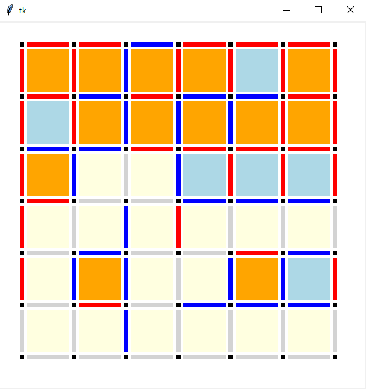

# CS 5751 - Dot and Boxes Game with Reinforcement Learning

This is a class project for the course CS 5751 - Introduction to Machine Learning and Data Mining. The objective of this project is to build an agent that can play the game dots and boxes with a decent level. In the project, we buit several agents using different RL algorithms including TD-0 Learning and Q-Learning. In this repository, only the implementation or Q-Learning is included. However, it is quiet easy to implement a TD-0 Learning algorithm. The GUI is a modified version of the implementation we found online. Please refer to our final report for more information about the project.

Team members:
  + Andrew Miller
  + Dale Dowling
  + Nam Phung
  + Yichen Wei

Instructions:
  + Clone this repository
  + Go to the src folder
  + Execute command "python tk_game.py" to run the game
  + Execute command "python Learner.py" to make agent learn to play dots and boxes

Credits to Danny Yoo at UCLA Berkeley for the amazing implementation of the GUI for dots and boxes game. For more information about the GUI, please visit: https://www.hashcollision.org/hkn/python/dots-and-boxes/

